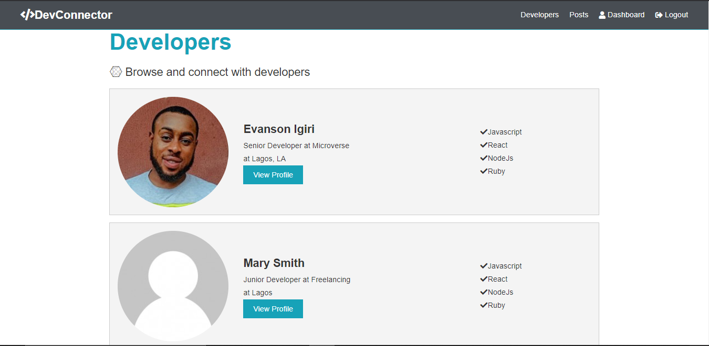

# Social-App

A social application called DevConnector, where developers connect with each other built with React/Redux, NodeJs and MongoDB.

This project was bootstrapped with [Create React App](https://github.com/facebook/create-react-app).

## snapshot

## live demo

[DevConnector](https://evanson-dev-connector.herokuapp.com/)

## Nice to have requirements

- Chat functionality where developers can talk to each other at real-time.
- Social login/Register with google, facebook etc.

## What it does?

- When the App is executed, you will be able to:

- Login or Register as a new user;
- Create your profile by inputing your developer and educational experience.
- Get a list of developers.
- View post from other developers and partake in the discussions;

## Built with

- React
- JavaScript/ES6
- React Hooks
- React Router
- Redux
- React Redux
- Heroku

### Prerequisites

- Node
- Npm

### Setup

- git clone `https://github.com/evansinho/Social-App`
- cd Social-App.
- run npm install on the root directory.
- then cd to client and run npm install.
- Go back to the root and run npm dev and your app will run at `localhost:3000`

## Authors

👤 **Evanson Igiri**

- [Portfolio](https://evansinho.github.io/Evanson-igiri/)
- [Twitter](https://twitter.com/iamevanson)
- [Linkedin](LinkedIn.com/in/evanson-igiri)
- [Email](mailto:igiri.evanson@gmail.com)

## 🤝 Contributing

Contributions, issues and feature requests are welcome!

Feel free to check the [issues page](https://github.com/evansinho/Social-App/issues).

## Show your support

Give a ⭐️ if you like this project!

## Acknowledgments

- MIcroverse
- Microverse TSE's

## 📝 License

This project is [Apache](lic.url) licensed.
